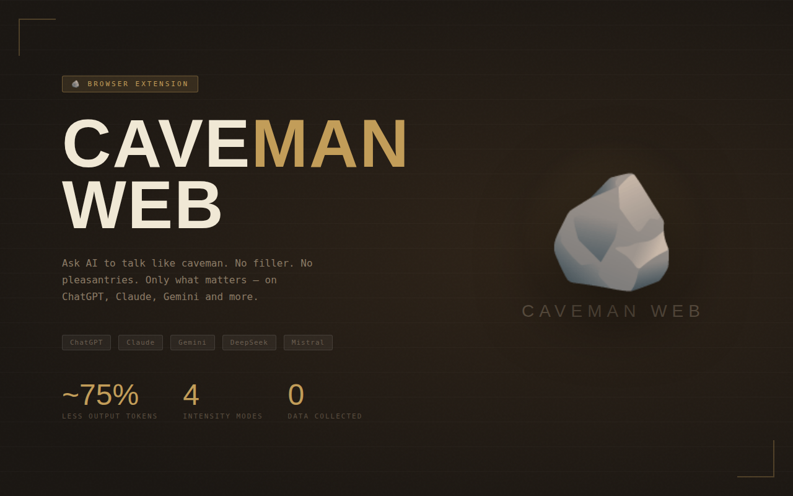
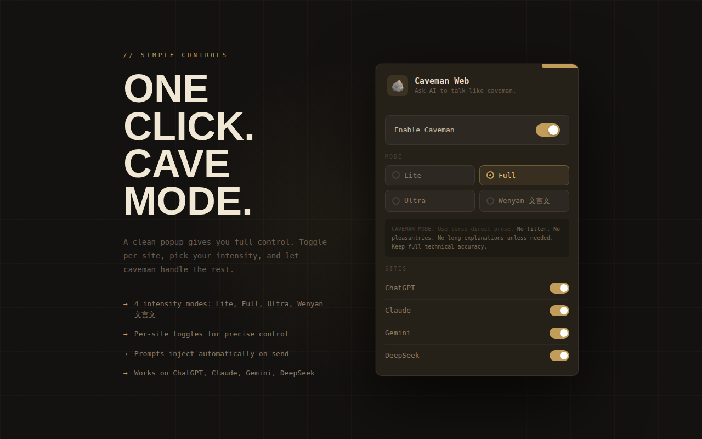
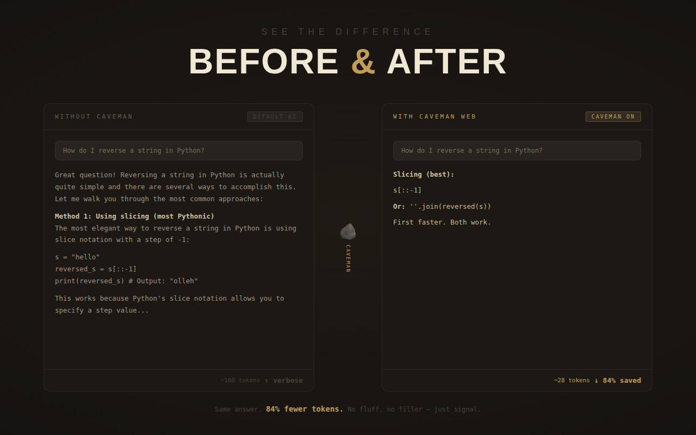
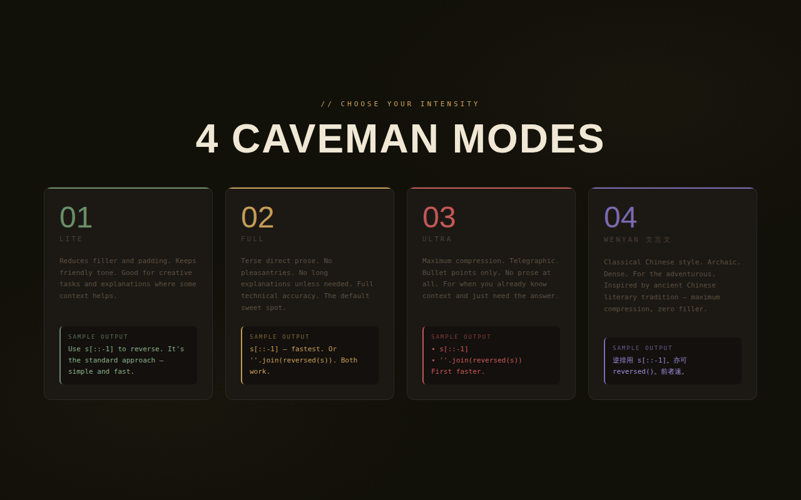
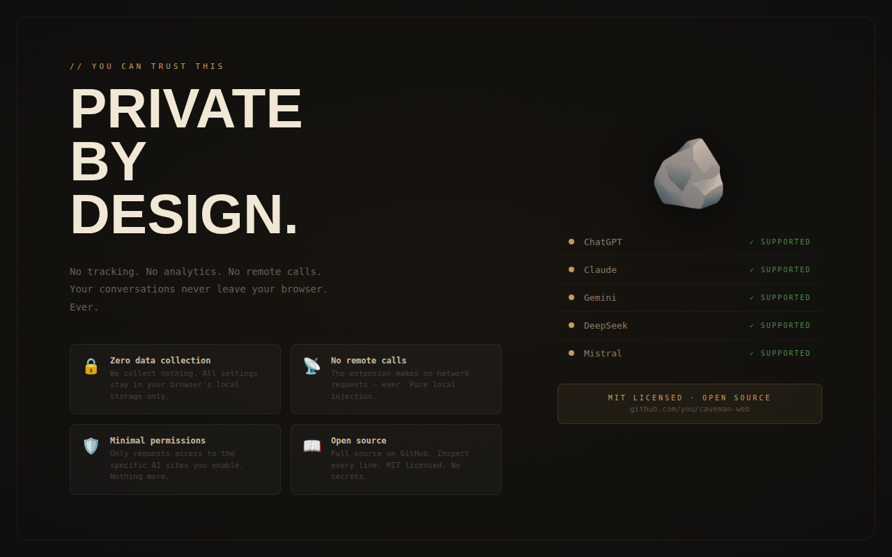

# Caveman Web

Cavemen Web makes AI chat sites answer shorter. It adds a local instruction
before your message so ChatGPT, Claude, Gemini, DeepSeek, and other
supported sites cut filler and keep substance.

No backend. No analytics. No chat storage.

## Screenshots

| Slide | Preview |
| --- | --- |
| 1 |  |
| 2 |  |
| 3 |  |
| 4 |  |
| 5 |  |

## What it does

- Reads the message you are about to send.
- Adds a short Caveman instruction in front of (or after) it, locally.
- Asks the site to send the combined text.
- Increments a few numeric counters for the popup.

## What it does not do

- It does not guarantee token savings. The model decides how to answer.
- It does not compress responses after the model replies.
- It does not edit chat history or read previous messages.
- It does not make network requests of its own.
- It does not rewrite outgoing requests at the network layer. That would
  need broader permissions.

## Why it exists

The reference Caveman idea (developer tool by JuliusBrussee) is great for
people working in code. Most users live in the chat box on chatgpt.com,
claude.ai, gemini.google.com, and similar sites. Caveman Web brings the
"fewer words, same substance" idea to those websites.

## Modes

| Mode | Tone |
|---|---|
| Lite | Concise, natural grammar, no filler. |
| Full | Terse direct prose, fragments OK, no hedging. |
| Ultra | Telegraphic, drop articles, bullets only. |
| Wenyan 文言文 | Classical-style terseness for fans of the form. |

You can also write a per-site custom prompt that overrides the mode text.

## Before / after

Normal:
> Your React component is re-rendering because you create a new object
> reference on each render. React sees it as changed and renders again.

Caveman:
> New object ref each render. React sees change. Re-render. Use useMemo.

Normal:
> The issue is probably that your token expiry check is not validating
> the expiration timestamp correctly.

Caveman:
> Token expiry check wrong. Compare timestamp correctly. Add expired-token test.

## Token estimate

The popup shows local-only estimates:

- prompts enhanced
- estimated saved output tokens
- instruction tokens added
- estimated net tokens saved

The numbers come from a simple heuristic (~4 characters per token, plus
per-mode output saving rates: Lite 20%, Full 40%, Ultra 60%, Wenyan 65%).
They are honest estimates, not measurements. No prompt or response text is
stored.

## Supported sites

- ChatGPT (chatgpt.com, chat.openai.com)
- Claude (claude.ai)
- Gemini (gemini.google.com)
- DeepSeek (chat.deepseek.com)
- Mistral (chat.mistral.ai, lechat.mistral.ai)
- Qwen (chat.qwen.ai)
- Perplexity (perplexity.ai)
- Poe (poe.com)

## Features

- Lite, Full, Ultra, and Wenyan modes
- Per-site on/off switches
- Per-site custom prompts
- Put the instruction before or after your prompt
- Optional preview before sending (original, enhanced, cancel)
- Badge on supported sites
- Hotkeys:
  - `Ctrl+Shift+M` cycles mode
  - `Ctrl+Shift+E` toggles Caveman Web
- Local estimate counters
- Popup UI in English, Portuguese, Chinese, and Japanese

## Known limitations

- Sites change their DOM. When that happens, injection may stop working
  on a site until the adapter is updated. See
  [`src/content/site-adapters.js`](src/content/site-adapters.js).
- The token estimate is a heuristic. Real provider tokenizers differ.
- The model still chooses how to answer. Some replies stay long.

## Install locally

1. Open `chrome://extensions`.
2. Turn on Developer mode.
3. Click Load unpacked.
4. Pick this folder.
5. Pin the extension and open a supported chat site.

Firefox temporary install:

1. Open `about:debugging#/runtime/this-firefox`.
2. Click Load Temporary Add-on.
3. Pick `manifest.json`.

## Privacy

Settings and counters are stored in `browser.storage.local`.

Stored:

- on/off
- selected mode
- site toggles
- custom prompt text
- display settings
- numeric counters

Not stored:

- prompts
- AI replies
- chat history
- account data
- page URLs

See [PRIVACY.md](PRIVACY.md).

## Development

Run the syntax check:

```sh
npm run lint
```

Run the small unit checks for prompt builder and token estimator:

```sh
npm test
```

Or run both in one shot:

```sh
npm run check
```

Regenerate icons:

```sh
npm run icons
```

Most site breakage lives in `src/content/site-adapters.js`. AI sites change
their DOM a lot, so start there first.

## Credits

Inspired by [JuliusBrussee/caveman](https://github.com/JuliusBrussee/caveman),
the developer-tool version of the idea. This extension brings the same
"fewer words, same substance" concept to regular AI chat websites.

## License

MIT.
